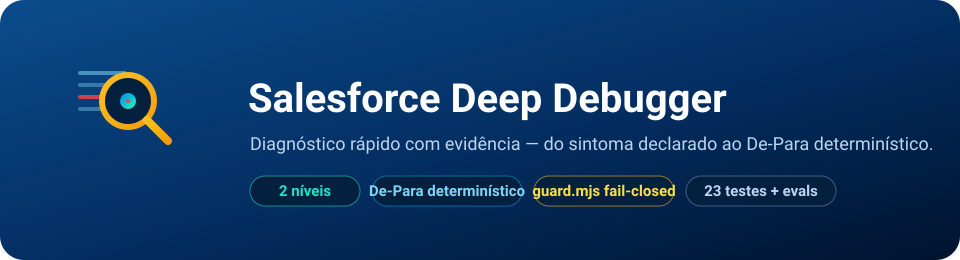

# Salesforce Deep Debugger

<p align="center">

  
</p>

<p align="center">
  
  
  
  
</p>

<p align="center">
  [](https://skills.sh/brunotrolo/Salesforce_Deep_Debugger) [](https://github.com/brunotrolo/Salesforce_Deep_Debugger/actions)
</p>

Diagnóstico **rápido e preciso** de um bug ou inconsistência declarado por um
desenvolvedor — numa jornada, numa regra de negócio, num componente.

O **Salesforce Deep Debugger** recebe o relato (ou um debug log/mensagem de exceção) e
vai direto ao ponto: classifica a falha, localiza a causa raiz **com evidência**, nunca
reproduzindo por execução, e sugere a correção em formato **De-Para**. Por padrão só
diagnostica; corrige e faz um quick deploy — sem rodar teste, deixado para depois da
homologação — só quando o desenvolvedor pede explicitamente.

---

## Por que esta skill existe

O resto do arsenal deste autor (`Salesforce_Apex-Cover-Loop`, `Salesforce_Journey_Developer`)
para exatamente no deploy: cobertura de teste e o portão de qualidade garantem que o
código está correto **antes** de ir para a org. Ninguém observa o que acontece **depois**
— quando o código já está rodando com tráfego real e algo quebra. Esta skill é esse elo.

**Não é uma reengenharia do [`Salesforce Archaeologist`](https://github.com/brunotrolo/Salesforce_Archaeologist).**
O Archaeologist é investigação pesada e deliberada — survey de uma org inteira, sob
demanda. Esta skill é resposta pontual e rápida a "isso quebrou, por quê" — e, se o
Archaeologist já rodou no mesmo projeto, **consome** o `CAPABILITIES_MAP.md` dele para
saber a que jornada/domínio o componente falho pertence, sem remapear nada do zero.

---

## Como funciona, em 2 níveis

```
┌───────────────────────────────────────────────────────────────┐
│                    Relato do desenvolvedor                    │
│         (linguagem natural, debug log, ou stack trace)        │
└───────────────────────────────┬───────────────────────────────┘
                                 ▼
┌───────────────────────────────────────────────────────────────┐
│  NÍVEL 1 — Diagnóstico (padrão, sempre acontece)               │
│  Intake → Triagem → Causa raiz (5 Porquês / escalonamento) →  │
│  Resposta em 2 blocos + De-Para (texto, nada é tocado)         │
└───────────────────────────────┬───────────────────────────────┘
                                 │  só se pedido explícito
                                 ▼
┌───────────────────────────────────────────────────────────────┐
│  NÍVEL 2 — Correção explícita                                  │
│  Aplica o MESMO De-Para já mostrado → quick deploy escopado,   │
│  --test-level NoTestRun → teste fica para a homologação        │
└─────────────────────────────────────────────────────────────────┘
```

| Etapa | O que faz |
|---|---|
| **Intake** | Normaliza a entrada (relato em linguagem natural, log colado, arquivo, mensagem isolada). Se falta evidência mínima, pergunta em vez de adivinhar (`references/intake-checklist.md`) |
| **Triagem** | Classifica a falha numa de 6 categorias (governor limit, exceção não tratada, callout externo, permissão FLS/sharing, erro de Flow, erro de LWC) ou na pré-triagem de pacote/change set rejeitado (categoria 0 — separa por conferência exata de lista o que faltou incluir do que é defeito real; `references/failure-taxonomy.md`) |
| **Causa raiz** | Aplica a checklist de diagnóstico da categoria, com **5 Porquês** para desempatar hipóteses e um scan estático opcional (Salesforce Code Analyzer/Apex Guru) só se a checklist não bastar. Três desfechos, e só três: confirmada, hipóteses concorrentes, ou evidência insuficiente |
| **Resposta** | Dois blocos, sempre separados — o que foi pedido, e (se houver) o que foi notado a mais. Se a causa foi confirmada, vem junto um **De-Para**: o trecho como está e como precisa ficar, lado a lado, mais o diff equivalente. Só texto — nada é escrito, nenhum deploy acontece |
| **Correção (Nível 2)** | Aplica exatamente o De-Para já mostrado — nunca deriva um fix novo na hora de aplicar. Quick deploy escopado só ao artefato corrigido, sempre `--test-level NoTestRun`. Teste sempre fica para depois, como passo humano posterior (tipicamente `apex-test-loop`) |

---

## O que ela nunca faz, em nenhum nível

- Nunca corrige sem pedido explícito — sem pedido, para no diagnóstico.
- Nunca roda teste (local, sandbox ou produção) para reproduzir ou homologar — isso é
  sempre um passo separado, humano, posterior.
- Nunca faz deploy amplo, sem escopo, ou com qualquer nível de teste — só o quick
  deploy escopado + `NoTestRun` chega a pedir confirmação.
- Nunca muta dado ou apaga org/projeto — `deny` incondicional, reforçado tecnicamente
  por um hook (`guard.mjs`), não só em prosa.
- Nunca inventa causa raiz sem evidência, nem mistura achado colateral com a resposta
  ao que foi pedido.
- Nunca persiste log bruto com dado real de cliente sem passar pela checklist de
  redação de PII.

---

## Pré-requisitos

- **Salesforce CLI (`sf`)** v2+ instalado e autenticado, se for usar o Nível 2 (quick deploy) ou o escalonamento opcional (Code Analyzer/Apex Guru)
- **Node.js ≥ 18** (para os scripts determinísticos, `guard.mjs` e os testes — zero dependências externas)
- Um debug log, mensagem de exceção, ou simplesmente o relato do bug — nenhum é estritamente obrigatório sozinho, mas a Fase de Intake exige o mínimo de `references/intake-checklist.md`

---

## Como começar

### Instalação

Rode **de dentro da pasta do projeto** onde você quer investigar incidentes:

**Mac / Linux / Git Bash:**
```bash
git clone --depth 1 https://github.com/brunotrolo/Salesforce_Deep_Debugger.git .ddbg-tmp && mkdir -p .claude && cp -r .ddbg-tmp/.claude/. .claude/ && cp -rn .ddbg-tmp/docs/. docs/ 2>/dev/null; rm -rf .ddbg-tmp
```

**Windows (PowerShell):**
```powershell
git clone --depth 1 https://github.com/brunotrolo/Salesforce_Deep_Debugger.git .ddbg-tmp; New-Item -ItemType Directory -Force .claude | Out-Null; Copy-Item -Recurse -Force .ddbg-tmp\.claude\* .claude\; if (-not (Test-Path docs\incidents)) { New-Item -ItemType Directory -Force docs\incidents | Out-Null; Copy-Item .ddbg-tmp\docs\incidents\README.md docs\incidents\ }; Remove-Item -Recurse -Force .ddbg-tmp
```

Se o projeto já tem um `.claude/settings.json` (de outra skill deste arsenal), **mescle
os dois** — uma `deny` unificada e os hooks `PreToolUse` lado a lado. Não sobrescreva.

Depois, abra o Claude Code na pasta do projeto — a skill, a rule e o hook de segurança
carregam automaticamente.

### Antes de usar contra um log real

Rode os selftests uma vez para confirmar que os extratores estão íntegros no seu ambiente:

```bash
bash .claude/skills/sf-deep-debugger/selftest/verify-commands.sh
node .claude/skills/sf-deep-debugger/selftest/verify-package-validation.mjs
node .claude/skills/sf-deep-debugger/selftest/verify-package-reference-scan.mjs
```

---

## O que entra no seu `.claude/`

| Caminho | O que faz | Quando carrega |
|---|---|---|
| `skills/sf-deep-debugger/SKILL.md` | Skill principal — os 2 níveis, fronteira com o Archaeologist | Sob demanda, via `/deep-debugger` ou trigger natural |
| `skills/sf-deep-debugger/references/` | Taxonomia de falhas, parsing de log, redação de PII, template De-Para, escalonamento oficial, mínimo de evidência | Sob demanda, uma seção por vez |
| `skills/sf-deep-debugger/scripts/` | `log-parser.mjs` (extração determinística) + `package-validation-parser.mjs`/`package-reference-scanner.mjs` (pacote/change set) + `guard.mjs` (hook de segurança dos 2 níveis) | Sob comando; `guard.mjs` a cada `Bash`/`Write`/`Edit` |
| `skills/sf-deep-debugger/selftest/` | Fixture de verdade conhecida + 3 selftests (`verify-commands.sh`, `verify-package-validation.mjs`, `verify-package-reference-scan.mjs`) — controle positivo dos 3 scripts de extração | Antes do primeiro uso, e após editar qualquer um dos 3 scripts |
| `skills/sf-deep-debugger/evaluations/` | 7 cenários comportamentais (query + expected_behavior) — testam a skill inteira, não só o código | Revisão manual, antes de mudança estrutural |
| `rules/karpathy-guidelines.md` | Disciplina comportamental: pense antes de codar, simplicidade, mudanças cirúrgicas, execução orientada a objetivo — contextualizada para diagnóstico de incidente | Início da sessão (sempre válida) |
| `settings.json` | Least-privilege (sem `bypassPermissions`) + hook `PreToolUse` do `guard.mjs` | Início da sessão |

### Uso

No Claude Code, dentro do projeto:

```
/deep-debugger

Cole aqui o debug log ou descreva o erro que apareceu em produção.
```

Ou aponte direto para um arquivo de log:

```bash
node .claude/skills/sf-deep-debugger/scripts/log-parser.mjs --log caminho/para/o.log
```

e peça para o agente interpretar a saída.

---

## Modelo de segurança dos 2 níveis

`guard.mjs` (hook `PreToolUse`) reforça tecnicamente o que o `SKILL.md` descreve em
prosa — nunca o contrário:

| Ação | Nível 1 (diagnóstico) | Nível 2 (correção explícita) |
|---|---|---|
| `sf data create/update/delete`, `sf org delete`, `sf project delete` | `deny` | `deny` — incondicional, nenhum nível libera |
| `sf apex run test` / `sf apex test run` | `deny` | `deny` — esta skill nunca roda teste |
| Deploy amplo, sem escopo, ou com qualquer nível de teste | `deny` | `deny` |
| Deploy escopado ao artefato + `--test-level NoTestRun` | — (nunca chega aqui) | `ask` — pede confirmação, nunca silencioso |
| Escrever/editar em `force-app/` | — (nunca chega aqui) | `ask` — a confirmação É o pedido explícito virando ação |
| Escrever em `docs/incidents/` | permitido | permitido |

Detalhes e limitações honestas em `references/safety-model.md`.

---

## Rodadas de consistência aplicadas

Esta skill passou por ciclos de verificação, incluindo pesquisa da documentação
oficial de autoria de skills da Anthropic antes da última rodada:

| Ciclo | Foco | Resultado |
|-------|------|-----------|
| 1 | Modelo comportamental | 2 níveis (diagnóstico/correção explícita), separação pedido vs. achado colateral |
| 2 | Redesenho de segurança | `guard.mjs` por escopo/nível de teste, não por comando bruto; achado e corrigido um `deny` de prefixo que anulava o quick deploy |
| 3 | Otimização de escopo | De-Para automático no diagnóstico, técnica dos 5 Porquês, escalonamento opcional a ferramenta oficial |
| 4 | Conformidade oficial Anthropic | `description` excedia 1024 caracteres (corrigida), TOC em referência >100 linhas, padrão Examples e Workflow checklist adicionados, 4 evaluations novas, typo real corrigido |
| 5 | Diagnóstico de pacote/change set | Categoria 0 (pré-triagem, não uma 7ª categoria peer): `package-validation-parser.mjs` separa por conferência exata de lista o que faltou incluir do que é defeito real; `package-reference-scanner.mjs` acha risco de próxima rodada (validação incremental do Salesforce para na 1ª leva de erros) como achado adicional, sempre rotulado "não confirmado". `guard.mjs`/quick deploy do Nível 2 intocados — a funcionalidade inteira é Nível 1, nunca deploya |

---

<p align="center">
  ⭐ <b><a href="https://github.com/brunotrolo/Salesforce_Deep_Debugger/stargazers">Dê uma star no repo</a></b> para ser avisado quando novas skills e melhorias saírem.
</p>

---

## Resumo — input, o que faz, o que entrega

| | |
|---|---|
| **Input** | Um bug/inconsistência declarado por um desenvolvedor — em linguagem natural, debug log, mensagem de exceção isolada, payload de erro, ou um pacote/change set rejeitado na validação (erro + lista de artefatos do pacote). Não requer log formal; a skill trabalha com o mínimo declarado, e pergunta pelo que falta em vez de adivinhar. |
| **O que faz** | Diagnostica em 2 níveis: 1) **Diagnóstico** — classifica a falha em 6 categorias (ou na pré-triagem de pacote, categoria 0), aplica checklist de causa raiz com evidência (5 Porquês para desempatar, escalonamento opcional a ferramenta oficial), e devolve resposta separada em pedido/achado colateral com sugestão De-Para quando confirmada; para pacote, entrega uma tabela por artefato (faltando no pacote vs. defeito real) sem nunca redeployar para descobrir; 2) **Correção explícita** — só sob pedido, aplica o mesmo De-Para e faz quick deploy escopado sem teste, deixando homologação para depois. |
| **Entrega** | Resposta estruturada (causa raiz + evidência + De-Para) no chat, e opcionalmente um relatório persistido em `docs/incidents/<data>-<slug>.md` com PII já redigida — formando um ledger que revela recorrência entre incidentes na mesma classe/método. |

---

## Relacionado

- **[Salesforce Archaeologist](https://github.com/brunotrolo/Salesforce_Archaeologist)** — Engenharia reversa completa de uma org/jornada; o Deep Debugger consome o `CAPABILITIES_MAP.md` dele quando presente, sem remapear nada
- **[Salesforce Apex-Cover-Loop](https://github.com/brunotrolo/Salesforce_Apex-Cover-Loop)** — Cobertura de teste autônoma, antes do deploy; homologação com teste depois de um fix do Deep Debugger é trabalho desta skill
- **[Salesforce Journey Developer](https://github.com/brunotrolo/Salesforce_Journey_Developer)** — Constrói a capacidade original; o Deep Debugger entra depois, quando algo já quebrou em produção

---

<p align="center">
  <sub>© <a href="https://github.com/brunotrolo">brunotrolo</a> · <a href="./LICENSE">MIT</a></sub>
</p>